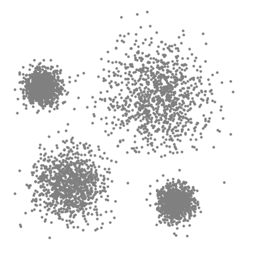

```{r message=FALSE, warning=FALSE}
library(dplyr)
library(MeanShift)
library(plotly)
library(knitr)
opts_chunk$set(fig.width=9.5, warning=FALSE)
```

```{r}
address <- url("http://www.trutschnig.net/RTR2015.RData")
load(address)
df <- RTR2015[sample(nrow(RTR2015), 1000), ]
```

# Motivation

1. Begin with a circular sliding window centered at a random point.
2. The window is shifted in the direction of the mean of the points; this brings the window naturally to an area with higher density.
3. Shift the windwo till there is no direction at which a shift can accomodat more points.
4. Do 1-3 with many starting points.


```{r}
plot_ly(df, x = ~longitude, y = ~latitude) %>% 
  add_markers(size=~rtr_speed_dl
              , text=~paste(paste("Download Speed: ", rtr_speed_dl)
                            , paste("Long: ", longitude)
                            , paste("Lat: ", latitude)
                            , sep = "<br />"
                            )
              , hoverinfo="text"
              )
```

```{r}
spatial_df_t <- t(df[,c("longitude", "latitude", "rtr_speed_dl")])
```

Apply standardization and form a set of candidate bandwiths.

```{r}
spatial_df_t <- spatial_df_t / apply(spatial_df_t, 1, sd)

h.cand <- quantile(dist(t(spatial_df_t)), seq(0.1, 0.40, by=0.05))
```

```{r}
system.time(
  bms.clustering <- lapply(h.cand, 
                           function(h){
                             bmsClustering(spatial_df_t, h=h)
                             }
                           )
  )
```

```{r}
resulting_df_s <- as.data.frame(t(spatial_df_t)) %>%
  select(longitude, latitude, rtr_speed_dl) %>% 
  mutate(cluster = as.factor(bms.clustering[[4]]$labels))

(resulting_df <- df %>% 
  select(longitude, latitude, rtr_speed_dl) %>% 
  mutate(cluster = as.factor(bms.clustering[[4]]$labels), rtr_speed_dl_s = rtr_speed_dl/sd(rtr_speed_dl)))
```

```{r}
g <- list(
  scope = 'europe',
  projection = list(type = 'natural earth'),
  showland = TRUE,
  countrywidth = 1,
  subunitwidth = 1
)

plot_geo(resulting_df, lon = ~longitude, lat = ~latitude) %>% 
  add_markers(size=~rtr_speed_dl_s
              , color=~cluster
              , text=~paste(paste("Download Speed: ", rtr_speed_dl)
                            , paste("Long: ", longitude)
                            , paste("Lat: ", latitude)
                            , sep = "<br />"
                            )
              , hoverinfo="text"
              ) %>% 
  layout(
    title = 'Mobile download speed in Austria'
    , geo = g
    , mapbox = list(style = "satellite-streets")
  )
```

```{r}
plot( spatial_df_t[1,], spatial_df_t[2,]
      , col=bms.clustering[[4]]$labels
      , xlab="longitude"
      , ylab="latitude"
      , main="Mean shift labels"
      , cex=spatial_df_t[3,], pch=16 
      )
points( bms.clustering[[4]]$components[1,], bms.clustering[[4]]$components[2,]
        , col=1:ncol( bms.clustering[[4]]$components)
        , pch="+"
        , cex=3 
        )
```

```{r}
p <- plot_ly(spatial_df_t %>% 
               t() %>% 
               as.data.frame()
             , x = ~longitude
             , y = ~latitude
             , z = ~rtr_speed_dl) %>%
  add_markers(color = bms.clustering[[4]]$labels)
p
```


